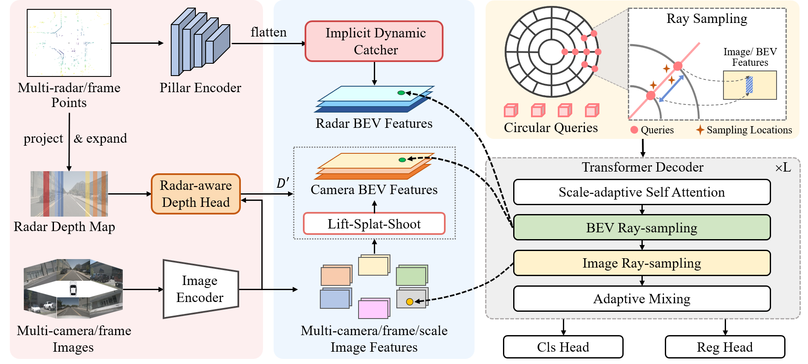

# RaCFormer
Official PyTorch Implementation of "RaCFormer: Towards High-Quality 3D Object Detection via Query-based Radar-Camera Fusion (CVPR 2025)"




## Environment

Install PyTorch 2.0 + CUDA 11.8:

```
conda create -n racformer python=3.8
conda activate racformer
conda install pytorch==2.0.0 torchvision==0.15.0 pytorch-cuda=11.8 -c pytorch -c nvidia
```


Install other dependencies:

```
pip install openmim
mim install mmcv-full==1.6.0
mim install mmdet==2.28.2
mim install mmsegmentation==0.30.0
mim install mmdet3d==1.0.0rc6
pip install setuptools==59.5.0
pip install numpy==1.23.5
```

Install turbojpeg and pillow-simd to speed up data loading (optional but important):

```
sudo apt-get update
sudo apt-get install -y libturbojpeg
pip install pyturbojpeg
pip uninstall pillow
pip install pillow-simd==9.0.0.post1
```

Compile CUDA extensions:

```
cd models/csrc
python setup.py build_ext --inplace
```

## Prepare Dataset

1. Download nuScenes from [https://www.nuscenes.org/nuscenes](https://www.nuscenes.org/nuscenes) and put it in `data/nuscenes`.
2. Download the generated info file from [Google Drive](https://drive.google.com/drive/folders/1Tec0I7tgJKF-w1_vVAScJ0wPek2YT28u?usp=sharing).
3. Folder structure:

```
data/nuscenes
├── maps
├── nuscenes_infos_test_sweep.pkl
├── nuscenes_infos_train_sweep.pkl
├── samples
├── sweeps
├── v1.0-test
└── v1.0-trainval
```

## Training

Download [pretrained ResNet-50](https://download.openmmlab.com/mmdetection3d/v0.1.0_models/nuimages_semseg/cascade_mask_rcnn_r50_fpn_coco-20e_20e_nuim/cascade_mask_rcnn_r50_fpn_coco-20e_20e_nuim_20201009_124951-40963960.pth) and put it in directory `pretrain/`:

```
pretrain
├── cascade_mask_rcnn_r50_fpn_coco-20e_20e_nuim_20201009_124951-40963960.pth
```

Train RaCFormer with 8 GPUs:

```
torchrun --nproc_per_node 8 train.py --config configs/racformer_r50_nuimg_704x256_f8.py
```

## Evaluation

Download the [model weights](https://drive.google.com/file/d/10Ky3lQWC2MLkQCpY81Jz5yxd4xWF8tAq/view?usp=sharing).

Single-GPU evaluation:

```
export CUDA_VISIBLE_DEVICES=0
python val.py --config configs/racformer_r50_nuimg_704x256_f8.py --weights checkpoints/r50_nuimg_704x256.pth
```

Multi-GPU evaluation:

```
export CUDA_VISIBLE_DEVICES=0,1,2,3,4,5,6,7
torchrun --nproc_per_node 8 val.py --config configs/racformer_r50_nuimg_704x256_f8.py --weights checkpoints/r50_nuimg_704x256.pth
```

## Acknowledgements

Many thanks to these excellent open-source projects:

* 3D Detection: [SparseBEV](https://github.com/MCG-NJU/SparseBEV), [PETR v2](https://github.com/megvii-research/PETR), [BEVFormer](https://github.com/fundamentalvision/BEVFormer), [BEVDet](https://github.com/HuangJunJie2017/BEVDet) 
* Codebase: [MMDetection3D](https://github.com/open-mmlab/mmdetection3d)
